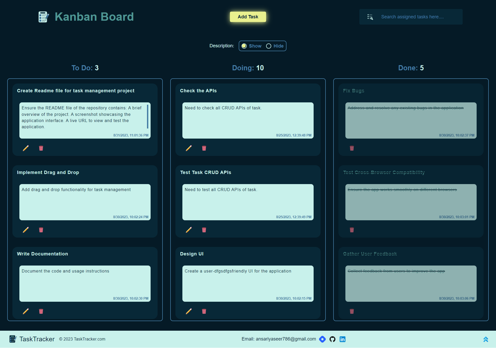

# Kanban Board Task Management MERN-Stack Project

The Kanban Board Task Management Project is a full-stack web application designed to help users manage tasks efficiently using the Kanban board methodology. The project encompasses both front-end and back-end technologies to create a seamless user experience for organizing and tracking tasks.

### Front-End:

The front-end of the application is built using React.js, a popular JavaScript library for building user interfaces. The user interface provides a visually appealing and intuitive Kanban board layout, where tasks are organized into three columns: "TODO," "DOING," and "DONE." The React Beautiful DND library is utilized to enable drag-and-drop functionality, allowing users to easily move tasks between columns as they progress.

### Back-End:

The back-end of the application is powered by Node.js and Express.js, creating a RESTful API for managing tasks. MongoDB is used as the database to store task information. The Mongoose library is employed to define the data schema and interact with the database.

## Technologies Used

**Front-End:**

- React.js
- React Beautiful DND (Drag-and-drop library)
- Bootstrap (CSS framework for responsive design)
- Axios (HTTP client for API requests)
- react-toastify (Notification library)

**Back-End:**

- Node.js (JavaScript runtime for building server-side applications)
- Express.js (Web application framework for Node.js)
- MongoDB (NoSQL database for storing task data)
- Mongoose (ODM library for MongoDB)
- MongoDB Atlas (Cloud-based database service)
- Render (Cloud platform for hosting back-end)
- RESTful API design
- CORS (Cross-Origin Resource Sharing middleware)
- dotenv (Library for handling environment variables)

## Live Demo URL

You can also see a live demo of this project here.

Or click the link below If above button doesn't work:

https://kanban-board-task-manager-mern-stack.vercel.app/

## Features

- **Create New Tasks**: Users can create tasks by providing titles and descriptions.
- **Edit Task Details**: Users can update task titles and descriptions.
- **Delete Tasks**: Tasks can be deleted from the Kanban board.
- **Organize with Kanban Board**: Tasks are organized using the Kanban board layout, allowing users to visualize task progress.
- **Drag-and-Drop Functionality**: The drag-and-drop feature enables users to move tasks between different status columns effortlessly.
- **Search Functionality**: Search for specific tasks using the search bar, allowing users to quickly find the information they need.
- **User-Friendly Notifications**: The application provides notifications for task-related actions, enhancing the user experience.

### Click the image below to watch a video demonstration of the project:

## 

## Deployment

- Front-End (React.js) deployed on [Vercel](https://kanban-board-task-manager-mern-stack.vercel.app/)
- Back-End (Node.js & Express.js) deployed on [Render](https://taskmanagement-webapp.onrender.com/)
- MongoDB database hosted on [MongoDB Atlas](https://www.mongodb.com/cloud/atlas)

## Installation and Setup

1.  Clone the repository:

        git clone <repository_url>

        cd kanban-board-task-management

2.  Install dependencies for both the client and server:

        cd client
        npm install

        cd ../server
        npm instal

3.  Set up environment variables:

    Create a `.env` file in the `server` directory and configure your MongoDB URI and any other necessary variables.

4.  Run the development server:

        cd ../client

        npm run dev

        cd ../server
        npm start

## API Endpoints

- `GET /api/tasks`: Get all tasks.
- `POST /api/tasks/create`: Create a new task.
- `PUT /api/tasks/:id`: Update task details.
- `DELETE /api/tasks/:id`: Delete a task.
- `PUT /api/tasks/:id/status`: Update task status.

## Acknowledgements

- This project was inspired by the concept of Kanban boards for task management.
- Thanks to the open-source community for the libraries and tools used in this project.

---
